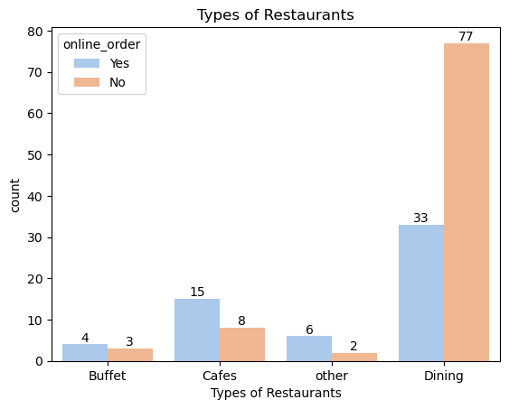
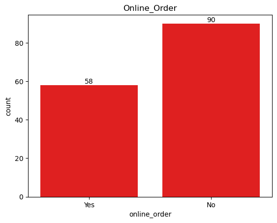
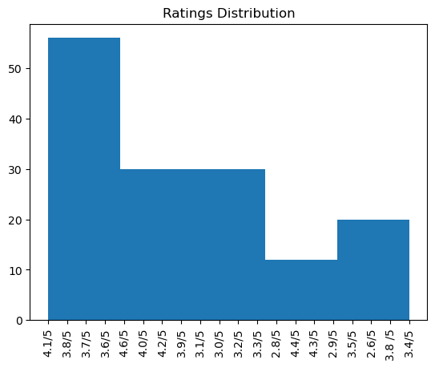
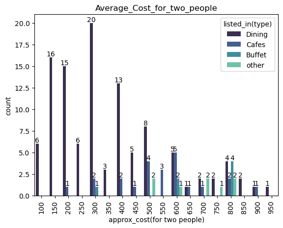
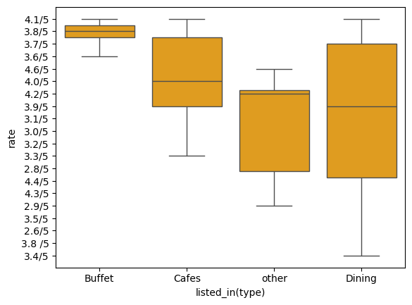
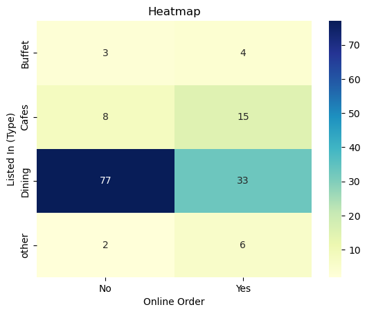

```python
import numpy as np
import pandas as pd
import seaborn as sns
import matplotlib.pyplot as plt
```


```python
df =pd.read_csv("C:/Users/yoges/Downloads/Zomato-data-.csv")
df.head()
```


<div>
<style scoped>
    .dataframe tbody tr th:only-of-type {
        vertical-align: middle;
    }

    .dataframe tbody tr th {
        vertical-align: top;
    }

    .dataframe thead th {
        text-align: right;
    }
</style>
<table border="1" class="dataframe">
  <thead>
    <tr style="text-align: right;">
      <th></th>
      <th>name</th>
      <th>online_order</th>
      <th>book_table</th>
      <th>rate</th>
      <th>votes</th>
      <th>approx_cost(for two people)</th>
      <th>listed_in(type)</th>
    </tr>
  </thead>
  <tbody>
    <tr>
      <th>0</th>
      <td>Jalsa</td>
      <td>Yes</td>
      <td>Yes</td>
      <td>4.1/5</td>
      <td>775</td>
      <td>800</td>
      <td>Buffet</td>
    </tr>
    <tr>
      <th>1</th>
      <td>Spice Elephant</td>
      <td>Yes</td>
      <td>No</td>
      <td>4.1/5</td>
      <td>787</td>
      <td>800</td>
      <td>Buffet</td>
    </tr>
    <tr>
      <th>2</th>
      <td>San Churro Cafe</td>
      <td>Yes</td>
      <td>No</td>
      <td>3.8/5</td>
      <td>918</td>
      <td>800</td>
      <td>Buffet</td>
    </tr>
    <tr>
      <th>3</th>
      <td>Addhuri Udupi Bhojana</td>
      <td>No</td>
      <td>No</td>
      <td>3.7/5</td>
      <td>88</td>
      <td>300</td>
      <td>Buffet</td>
    </tr>
    <tr>
      <th>4</th>
      <td>Grand Village</td>
      <td>No</td>
      <td>No</td>
      <td>3.8/5</td>
      <td>166</td>
      <td>600</td>
      <td>Buffet</td>
    </tr>
  </tbody>
</table>
</div>


```python
df.drop_duplicates(inplace=True)
```


```python
df.info()
```

    <class 'pandas.core.frame.DataFrame'>
    RangeIndex: 148 entries, 0 to 147
    Data columns (total 7 columns):
     #   Column                       Non-Null Count  Dtype 
    ---  ------                       --------------  ----- 
     0   name                         148 non-null    object
     1   online_order                 148 non-null    object
     2   book_table                   148 non-null    object
     3   rate                         148 non-null    object
     4   votes                        148 non-null    int64 
     5   approx_cost(for two people)  148 non-null    int64 
     6   listed_in(type)              148 non-null    object
    dtypes: int64(2), object(5)
    memory usage: 8.2+ KB
    


```python
df.head(10)
```


<div>
<style scoped>
    .dataframe tbody tr th:only-of-type {
        vertical-align: middle;
    }

    .dataframe tbody tr th {
        vertical-align: top;
    }

    .dataframe thead th {
        text-align: right;
    }
</style>
<table border="1" class="dataframe">
  <thead>
    <tr style="text-align: right;">
      <th></th>
      <th>name</th>
      <th>online_order</th>
      <th>book_table</th>
      <th>rate</th>
      <th>votes</th>
      <th>approx_cost(for two people)</th>
      <th>listed_in(type)</th>
    </tr>
  </thead>
  <tbody>
    <tr>
      <th>0</th>
      <td>Jalsa</td>
      <td>Yes</td>
      <td>Yes</td>
      <td>4.1/5</td>
      <td>775</td>
      <td>800</td>
      <td>Buffet</td>
    </tr>
    <tr>
      <th>1</th>
      <td>Spice Elephant</td>
      <td>Yes</td>
      <td>No</td>
      <td>4.1/5</td>
      <td>787</td>
      <td>800</td>
      <td>Buffet</td>
    </tr>
    <tr>
      <th>2</th>
      <td>San Churro Cafe</td>
      <td>Yes</td>
      <td>No</td>
      <td>3.8/5</td>
      <td>918</td>
      <td>800</td>
      <td>Buffet</td>
    </tr>
    <tr>
      <th>3</th>
      <td>Addhuri Udupi Bhojana</td>
      <td>No</td>
      <td>No</td>
      <td>3.7/5</td>
      <td>88</td>
      <td>300</td>
      <td>Buffet</td>
    </tr>
    <tr>
      <th>4</th>
      <td>Grand Village</td>
      <td>No</td>
      <td>No</td>
      <td>3.8/5</td>
      <td>166</td>
      <td>600</td>
      <td>Buffet</td>
    </tr>
    <tr>
      <th>5</th>
      <td>Timepass Dinner</td>
      <td>Yes</td>
      <td>No</td>
      <td>3.8/5</td>
      <td>286</td>
      <td>600</td>
      <td>Buffet</td>
    </tr>
    <tr>
      <th>6</th>
      <td>Rosewood International Hotel - Bar &amp; Restaurant</td>
      <td>No</td>
      <td>No</td>
      <td>3.6/5</td>
      <td>8</td>
      <td>800</td>
      <td>Buffet</td>
    </tr>
    <tr>
      <th>7</th>
      <td>Onesta</td>
      <td>Yes</td>
      <td>Yes</td>
      <td>4.6/5</td>
      <td>2556</td>
      <td>600</td>
      <td>Cafes</td>
    </tr>
    <tr>
      <th>8</th>
      <td>Penthouse Cafe</td>
      <td>Yes</td>
      <td>No</td>
      <td>4.0/5</td>
      <td>324</td>
      <td>700</td>
      <td>other</td>
    </tr>
    <tr>
      <th>9</th>
      <td>Smacznego</td>
      <td>Yes</td>
      <td>No</td>
      <td>4.2/5</td>
      <td>504</td>
      <td>550</td>
      <td>Cafes</td>
    </tr>
  </tbody>
</table>
</div>


```python
ax = sns.countplot(x="listed_in(type)",
                   hue="online_order",
                   data=df, palette="pastel") 
                   for bars in ax.containers:
                   ax.bar_label(bars)

plt.title("Types of Restaurants")
plt.xlabel("Types of Restaurants")

```


    

    


Insight: Most of the restaurants belong to the dining category and same with online orders.


```python
ax= sns.countplot(x="online_order",
                  data=df,
                 color="red")
plt.title("Online_Order")
for bars in ax.containers:
    ax.bar_label(bars)
```


    

    


Insight: This chart shows that most of the restaurants do not accept online order.


```python
plt.hist(df['rate'],bins=5)
plt.title('Ratings Distribution')
plt.xticks(rotation="vertical")
plt.show()
plt.figure(figsize=(12,8))
```


    

    


    <Figure size 1200x800 with 0 Axes>


    <Figure size 1200x800 with 0 Axes>


Insight: Majority of the restaurants have rating between 3.5 to 4.1.


```python
ax= sns.countplot(x="approx_cost(for two people)",
                  data=df,
                  hue="listed_in(type)",
                  palette="mako")
plt.title("Average_Cost_for_two_people")
plt.xticks(rotation="vertical")
for bars in ax.containers:
    ax.bar_label(bars)
```


    

    


Insights: Most couples choose restaurants where the average cost is around 300 rupees.


```python
ax= sns.boxplot(x="listed_in(type)",
                y="rate",
                data=df,
               color="orange")
```


    

    


Insight: Offline orders had lower ratings, while online orders received outstanding feedback.


```python
pivot_table = df.pivot_table(index='listed_in(type)', columns='online_order', aggfunc='size', fill_value=0)
sns.heatmap(pivot_table, annot=True, cmap='YlGnBu', fmt='d',)
plt.title('Heatmap')
plt.xlabel('Online Order')
plt.ylabel('Listed In (Type)')


```


    Text(50.722222222222214, 0.5, 'Listed In (Type)')


    

    


```python
Insight: Most dining restaurants mainly rely on offline orders, while cafes tend to receive the majority of their orders online. This indicates that customers prefer in-person ordering at restaurants but favor online orders when it comes to cafes.
```


```python

```
